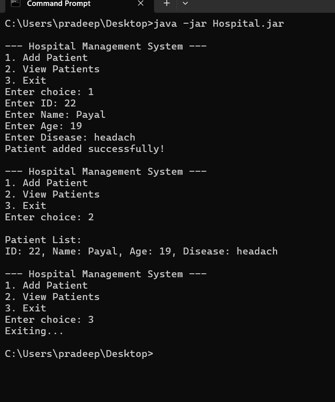

# 🏥 Hospital Management System (Kotlin)

## 📌 About Project
This is a simple console-based Hospital Management System made using Kotlin.

---

## ▶ How to Run

### Compile:
```bash
kotlinc Hospital.kt -include-runtime -d Hospital.jar

### Run:
```bash
java -jar Hospital.jar


## 💻 Output

--- Hospital Management System ---
1. Add Patient
2. View Patients
3. Exit

Enter choice: 1
Enter ID: 22
Enter Name: Payal
Enter Age: 19
Enter Disease: headache
Patient added successfully!


## 📸 Output Screenshot


